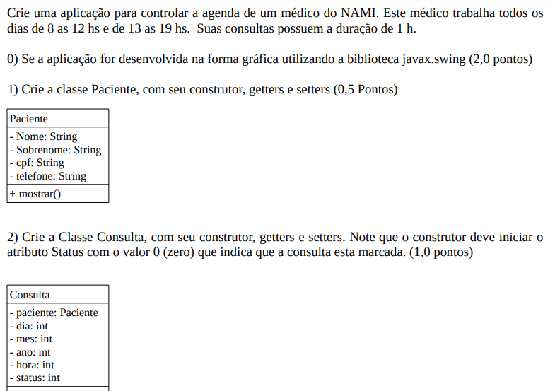

<h1 align="center">
📄Aluno: Lucas Araújo Matricula: 2215161
</h1>

# Consultas NAMI POO

> Última atividade de POO - aplicação para controlar a agenda de um médico do NAMI (UNIFOR).

### Ajustes e melhorias

O projeto ainda está em desenvolvimento e as próximas atualizações serão voltadas nas seguintes tarefas:

- [x] Implementação das classes
- [x] Métodos: adicionar, confirmar, realizar, cancelar
- [x] Métodos: listar e pesquisar + tratamento de exceções
- [x] Finalizações e correções de bugs
